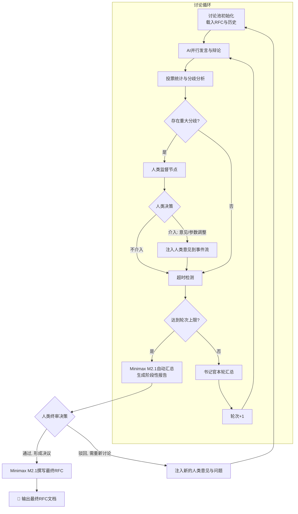

我将为您把整个“RFC智能评审工作流”设计整理为一份结构化技术文档，这份文档遵循软件系统设计文档的规范格式，包含了所有核心观点、设计决策和技术细节，可直接作为Minimax的输入来生成评审意见。

---

## **RFC智能体协同评审系统设计文档**

### **1. 项目概述**

#### **1.1 设计背景**
当前技术RFC（Request for Comments）的评审过程通常依赖有限的专家人工进行，存在效率瓶颈、视角单一、难以追踪等痛点。本项目旨在设计并实现一个基于多智能体（Multi-Agent）系统的智能化RFC评审工作流，通过模拟“技术议会”的辩论场景，对RFC草案进行多角度、深层次、可追溯的自动化评审，最终辅助人类架构师做出更高质效的决策。

#### **1.2 核心目标**
1.  **多视角深度分析**：模拟不同技术角色（架构、安全、运维等）的专家，对RFC进行并发、对抗性的评审。
2.  **动态共识形成**：通过多轮辩论、投票和迭代，使智能体间能够像真实社区一样讨论、妥协并形成共识或清晰的分歧点。
3.  **人在回路的最终裁决**：确保人类专家（主席）在任何阶段拥有最高决策权，可以中断流程、注入意见或做出最终裁定。
4.  **流程标准化与可复用**：将评审过程固化为一个可配置、可执行的工作流，适用于不同类型的RFC。

### **2. 系统架构与核心设计理念**

#### **2.1 核心设计理念：“动态议会制”**
系统摒弃传统的线性评审流程，采用“动态议会制”模拟：
- **议员**：由多个AI智能体担任，每个被赋予特定的技术角色、性格立场和专业知识。
- **议会**：评审事件本身，设有明确的发言、辩论、投票和休会规则。
- **主席**：由人类用户担任，负责引导议程、打破僵局并行使最终裁决权。
- **书记官**：由核心AI模型（如Minimax M2.1）担任，负责记录、总结和起草文件。

#### **2.2 技术架构选型：LangGraph**
选用**LangGraph**作为核心框架，因其具备：
- **有状态的工作流**：原生支持维护和管理复杂的多轮对话状态。
- **图的灵活性**：可以直观地建模循环、条件分支和并行执行路径。
- **人工中断机制**：内置支持在任意节点暂停工作流，等待外部输入。
- **良好的模型兼容性**：支持集成OpenAI、Anthropic、Minimax等多种大模型。

### **3. 详细系统设计**

#### **3.1 状态设计（事件溯源模式）**

系统采用 **事件溯源（Event Sourcing）** 模式，所有状态变更记录为不可变事件，状态 = 事件的聚合结果。

```python
from dataclasses import dataclass, field
from datetime import datetime
from enum import Enum
from typing import TypedDict, Literal, Annotated
from operator import add

class EventType(Enum):
    """事件类型枚举"""
    ROLE_REVIEW = "role_review"           # 角色评审发言
    VOTE = "vote"                         # 投票行为
    HUMAN_INTERVENTION = "human"          # 人类干预
    HUMAN_DECISION = "human_decision"     # 人类最终决策
    CONSENSUS_REACHED = "consensus"       # 达成共识
    CLARIFICATION = "clarification"       # 书记官澄清
    ROUND_COMPLETE = "round_complete"     # 轮次完成

@dataclass
class DiscussionEvent:
    """讨论事件（不可变数据单元）"""
    event_type: EventType
    actor: str                    # 触发者：角色名称或 "human"
    content: str                  # 事件内容
    timestamp: datetime = field(default_factory=datetime.now)
    metadata: dict = field(default_factory=dict)  # 额外信息

    # 投票事件特有
    vote_result: Literal["赞成", "反对", "弃权", None] = None
    target_issue: str | None = None  # 针对的议题ID

    # 人类干预特有
    human_action: Literal["意见注入", "参数调整", "强制通过", "强制驳回", "继续", None] = None

class DiscussionState(TypedDict):
    """
    工作流状态（物化视图）
    所有字段从事件流派生，支持回溯和重放
    """
    # === 事件流（不可变，追加写入）===
    events: Annotated[list[DiscussionEvent], lambda x, y: x + y]

    # === 物化视图（从事件派生，可缓存）===
    rfc_content: str                       # 原始RFC内容
    max_rounds: int                        # 最大轮次（配置）
    current_round: int                     # 当前轮次
    current_focus: str                     # 当前轮次的争议焦点
    consensus_points: Annotated[list, add]  # 已达成共识的条目列表
    open_issues: Annotated[list, add]       # 待决议项列表（含正反方论点）

    # === 流程控制 ===
    awaiting_human_input: bool              # 是否暂停等待人类输入
    human_decision: dict | None             # 人类决策结果
    last_human_action: str | None           # 上次人类操作类型
    timeout_count: int                      # 超时次数
    workflow_status: Literal["讨论中", "待人类决策", "已完成", "已终止"]  # 工作流状态
```

**核心优势**：
- ✅ 数据流向清晰：只允许 `events.append()`，禁止随机修改
- ✅ 便于回溯：任何状态都可从事件流重建
- ✅ 天然支持并发：事件天然有序

#### **3.2 智能体角色设计**
系统采用 **"单一模型 + 多角色提示词"** 策略，使用一个主模型（如Minimax M2.1）通过不同的系统提示词扮演所有专家角色，以保证风格一致性和成本可控性。

**角色分层架构**：

```
┌─────────────────────────────────────┐
│  决策层（可选参与）                   │
│  - 人类主席（最终裁决）               │
├─────────────────────────────────────┤
│  评审层（必须参与辩论与投票）          │
│  - 首席架构师 | 安全偏执狂            │
│  - 成本控制型运维 | 激进创新派        │
├─────────────────────────────────────┤
│  服务层（不参与评审，仅裁判汇总）      │
│  - 书记官（Minimax M2.1专属）         │
└─────────────────────────────────────┘
```

**角色定义示例**：

| 角色 | 类型 | 核心职责 | 发言规则 |
|------|------|----------|----------|
| **首席架构师** | 评审者 | 关注系统设计的长期扩展性、简洁性和技术债务 | 必须发言 |
| **安全偏执狂** | 评审者 | 默认不信任任何设计，发现所有潜在安全和合规风险 | 必须发言 |
| **成本控制型运维** | 评审者 | 关注部署复杂性、监控成本、资源消耗和故障恢复 | 必须发言 |
| **激进创新派** | 评审者 | 推崇新技术、新模式，挑战过于保守的设计 | 可选发言 |
| **书记官** | 服务者 | 仅负责总结所有模型的发言、提炼共识/分歧、起草最终报告 | **从不参与投票** |

**书记官核心职责**：
- **轮次总结**：每轮讨论结束后，汇总各方论点、投票结果、共识与分歧
- **共识裁判**：判定哪些议题已达成共识，哪些仍存在重大分歧
- **最终报告**：在工作流结束时，撰写完整的RFC评审报告
- **中立立场**：不发表技术观点，仅作为信息整理者和报告起草者

**每个角色的核心是一个结构化的系统提示词**，包含：
- **角色与使命**：明确身份和核心目标。
- **专业知识域**：给出评审的维度清单。
- **辩论风格与行为准则**：定义发言的性格（如攻击性、保守性）。
- **强制结构化输出格式**：确保输出可被程序解析（论点、论据、提问、投票）。

**评审者输出格式（强制）**：
```yaml
论点: "<一句话核心观点>"
论据: ["<支撑论据1>", "<支撑论据2>"]
针对议题: "<议题ID或标题>"
立场: "赞成|反对|弃权"
置信度: 0.0-1.0
```

#### **3.3 工作流控制（路由器模式）**

工作流控制采用 **路由器模式**，将路由逻辑集中管理，而非分散在各节点中。

```python
from enum import Enum
from dataclasses import dataclass
from typing import Callable

class RouteTarget(Enum):
    """路由目标枚举"""
    CONTINUE = "continue"                 # 继续讨论
    HUMAN_INTERVENTION = "human"          # 人类监督节点
    ROUND_SUMMARY = "summary"             # 书记官汇总
    FINAL_REPORT = "final_report"         # 生成最终报告
    EMERGENCY_STOP = "stop"               # 紧急停止

@dataclass
class RoutingRule:
    """路由规则定义"""
    name: str
    condition: Callable[[DiscussionState], bool]
    priority: int
    target: RouteTarget

class WorkflowRouter:
    """工作流路由器 - 集中管理路由逻辑"""

    def __init__(self, max_rounds: int = 10, timeout_minutes: int = 30):
        self.max_rounds = max_rounds
        self.timeout_minutes = timeout_minutes
        self.rules = self._build_rules()

    def _build_rules(self) -> list[RoutingRule]:
        """构建路由规则列表（按优先级排序）"""
        return [
            RoutingRule(
                name="emergency_stop",
                condition=lambda s: s.get("human_decision", {}).get("action") == "stop",
                priority=1,
                target=RouteTarget.EMERGENCY_STOP
            ),
            RoutingRule(
                name="human_intervention",
                condition=lambda s: s.get("awaiting_human_input", False),
                priority=2,
                target=RouteTarget.HUMAN_INTERVENTION
            ),
            RoutingRule(
                name="max_rounds_reached",
                condition=lambda s: s.get("current_round", 0) >= self.max_rounds,
                priority=3,
                target=RouteTarget.FINAL_REPORT
            ),
            RoutingRule(
                name="consensus_reached",
                condition=lambda s: len(s.get("open_issues", [])) == 0,
                priority=4,
                target=RouteTarget.FINAL_REPORT
            ),
            RoutingRule(
                name="round_complete",
                condition=lambda s: True,  # 默认每轮结束后汇总
                priority=5,
                target=RouteTarget.ROUND_SUMMARY
            ),
        ]

    def route(self, state: DiscussionState) -> RouteTarget:
        """根据状态路由到下一个节点"""
        sorted_rules = sorted(self.rules, key=lambda r: r.priority)
        for rule in sorted_rules:
            if rule.condition(state):
                return rule.target
        return RouteTarget.CONTINUE
```

**配置文件** (`config/workflow.yaml`)：
```yaml
routing:
  max_rounds: 10              # 最大讨论轮次
  round_timeout_minutes: 30   # 人类决策超时时间

  rules:
    - name: emergency_stop
      condition: "human_decision.action == stop"
      priority: 1

    - name: human_intervention
      condition: "awaiting_human_input == true"
      priority: 2

    - name: max_rounds_reached
      condition: "current_round >= max_rounds"
      priority: 3

    - name: consensus_reached
      condition: "open_issues is empty"
      priority: 4

thresholds:
  deadlock_opposition_ratio: 0.3   # 反对票超30%视为僵局
  consensus_quorum: 0.8            # 80%赞成即达成共识
```

#### **3.4 工作流节点与图设计**

工作流被构建为一个有状态的图，主要节点包括：

1.  **初始化节点（Init）**：
    - 载入RFC文档，解析内容，初始化事件流
    - 初始化 `current_round = 1`，`workflow_status = "讨论中"`

2.  **角色并行评审节点（ParallelReview）**：
    - 多个评审者角色节点并行执行
    - 每个节点接收：当前事件流 + RFC内容 + 其专属系统提示词
    - 调用 **同一个** 主模型（Minimax M2.1），产出不同观点
    - 每个角色输出：`论点`、`论据`、`立场`、`置信度`
    - 产出事件：`ROLE_REVIEW` + `VOTE`

3.  **投票统计与分歧分析节点（VoteAnalyzer）**：
    - 收集本轮所有投票
    - 计算赞成/反对/弃权分布
    - 识别重大分歧（反对票 > 30%）
    - 判定是否需要人类介入
    - 产出事件：`ROUND_COMPLETE`

4.  **人类监督节点（HumanOversight）**：
    - 这是一个 `interrupt` 节点，工作流暂停
    - 向人类主席呈现：本轮讨论摘要、分歧焦点、投票结果、当前轮次
    - **人类可选操作**：
      - `意见注入`：给出建设性意见，注入下一轮讨论
      - `参数调整`：调整最大轮次、超时时间等
      - `强制通过`：强制通过某议题
      - `强制驳回`：强制驳回某议题
      - `继续`：不干预，让AI继续讨论
      - `终止`：结束整个工作流
    - 产出事件：`HUMAN_INTERVENTION`

5.  **书记官总结节点（ClerkSummary）**：
    - 每轮讨论结束后触发（无论是否有人类介入）
    - 由 Minimax M2.1 以"书记官"身份运行
    - **核心任务**：
      - 汇总本轮各方论点
      - 提炼共识点与分歧点
      - 更新 `consensus_points` 和 `open_issues`
      - 为下一轮准备焦点议题
    - 产出事件：`CLARIFICATION`

6.  **超时检测节点（TimeoutChecker）**：
    - 检查人类决策是否超时
    - 如果超时且达到轮次上限 → 触发自动汇总
    - 如果超时但未达上限 → 继续讨论

7.  **最终报告生成节点（FinalReport）**：
    - 在工作流结束时触发
    - 由"书记官"整合完整事件流、共识列表、人类决策
    - 生成格式规范的 **RFC评审报告**
    - 产出事件：`HUMAN_DECISION`

#### **3.5 完整工作流循环逻辑**



**核心流程说明**：

| 阶段 | 触发条件 | 执行内容 | 产出 |
|------|----------|----------|------|
| **讨论中** | 轮次 < 上限 | AI并行评审、投票、分歧检测 | 事件流更新 |
| **人类介入** | 存在重大分歧 | 人类给出意见/参数调整/强制决策 | 注入新事件 |
| **超时自动汇总** | 人类超时 + 达到轮次上限 | Minimax M2.1 自动汇总 | 阶段性报告 |
| **最终决策** | 共识达成或轮次耗尽 | 人类做最终通过/驳回决策 | 最终报告 |

**循环驱动**：状态中的 `current_round` 和 `workflow_status` 驱动工作流循环。

**退出条件**：
1. 人类选择"通过，形成决议" → 生成最终报告
2. 人类选择"终止" → 工作流结束
3. 达到最大轮次 + 人类超时 → 自动汇总，人类最终决策

### **4. 关键配置与接口**

#### **4.1 模型配置**
- **主模型**：Minimax M2.1，通过其官方API调用。因其已购买Coding Plan，适用于代码和架构分析。
- **配置方式**：在环境变量中设置 `MINIMAX_API_KEY` 和 `BASE_URL`。所有角色节点均使用此配置。

#### **4.2 提示词工程库**
系统维护一个**提示词模板库**，以YAML或JSON格式存储每个角色的完整系统提示词，便于管理和迭代。

#### **4.3 人类交互接口**
- **本地开发**：使用LangGraph提供的开发服务器界面进行交互。
- **生产集成**：可通过API Webhook将中断事件推送至自定义前端（如聊天界面、仪表盘），接收用户决策后回调继续工作流。

### **5. 预期输出与价值**

#### **5.1 最终产出**
1.  **结构化评审报告**：包含RFC修订建议、共识点、遗留风险清单。
2.  **完整的讨论历程**：所有发言、投票的可追溯记录，满足审计需求。
3.  **决策依据**：清晰呈现给人类主席的决策点及其上下文。

#### **5.2 核心价值**
1.  **提升评审深度与广度**：通过角色扮演，强制覆盖安全、运维等多视角，避免盲点。
2.  **提高决策效率**：将人类专家从信息收集中解放，聚焦于最高价值的关键决策。
3.  **知识沉淀**：优秀的评审逻辑和提示词可沉淀为组织的数字资产。

## **6. 全自动RFC提案工作流（夜间守护进程）**

### **6.1 设计目标**

在您休息时（半夜），AI 自动运行三种工作流：

1.  **深度审计模式**：获取项目代码文本，分析设计缺陷、技术债务与改进机会
2.  **现有RFC预讨论模式**：对项目中已存在的 RFC 草案进行预讨论，生成预审意见
3.  **创新提案模式**：基于审计结果或自由发散，提出新 RFC 想法（需多轮智能体审核）

**核心原则**：
- **每日一议**：无论哪种模式，每日仅输出 **1 个最高优先级** 的结果
- **保证可处理性**：人类次日晨间只需处理一个经过充分讨论的输出
- **无缝衔接**：输出结果可直接送入主系统进行正式评审

### **6.2 系统架构与触发**

```
┌─────────────────────────────────────────────────────────────┐
│                    夜间守护进程（每日UTC 0:00触发）            │
├─────────────────────────────────────────────────────────────┤
│  输入源：                                                    │
│  ├── 代码库：通过Git API拉取最新代码，可聚焦特定目录           │
│  ├── Git Diff：可选择分析最新提交差异                         │
│  └── RFC库：读取所有已提出、讨论中、已归档的RFC文档           │
└─────────────────────────────────────────────────────────────┘
                              │
                              ▼
                    ┌─────────────────┐
                    │  模式选择路由    │
                    │ （轮询或随机）   │
                    └────────┬────────┘
                             │
         ┌───────────────────┼───────────────────┐
         ▼                   ▼                   ▼
   ┌──────────┐       ┌──────────┐       ┌──────────┐
   │ 深度审计 │       │ 现有RFC  │       │ 创新提案 │
   │  模式    │       │ 预讨论   │       │  模式    │
   └────┬─────┘       └────┬─────┘       └────┬─────┘
        │                  │                  │
        ▼                  ▼                  ▼
   代码分析报告      预审意见摘要       RFC草案雏形
        │                  │                  │
        └──────────────────┼──────────────────┘
                           ▼
                 ┌─────────────────┐
                 │   结果整合与     │
                 │   优先级排序     │
                 └────────┬────────┘
                          │
                          ▼
                 ┌─────────────────┐
                 │  书记官撰写最终  │
                 │  输出文档        │
                 └────────┬────────┘
                          │
                          ▼
                 ┌─────────────────┐
                 │  保存并发送通知  │
                 │  （每日仅1个）   │
                 └─────────────────┘
```

### **6.3 模式一：深度审计模式**

**目标**：获取项目代码文本，分析设计缺陷、技术债务

```
代码 → LLM分析 → 问题报告 → RFC草案 → 简化审核 → 输出
```

#### **步骤1：代码收集**
- 通过 Git API 拉取指定分支（如 main）的最新代码
- 可配置：全量分析 或 仅分析最新 Diff
- 支持聚焦特定目录（如 `/src/core`, `/src/api`）

#### **步骤2：LLM代码分析**
- **执行者**：诊断智能体（Minimax M2.1）
- **提示词核心**：
  ```
  你是一个苛刻的代码审查员。分析提供的代码（文件路径：{path}），目标：
  1. 设计反模式：单点故障、紧耦合、过度复杂、违反SOLID
  2. 潜在缺陷：资源泄漏、并发问题、安全漏洞、未处理边界
  3. 技术债务：重复代码、硬编码、魔法数字、缺失注释/测试

  请输出JSON格式：
  {
    "问题列表": [
      {
        "文件": "路径",
        "行号": 行号,
        "描述": "问题描述",
        "严重性": "高|中|低",
        "改进建议": "一句话建议"
      }
    ],
    "整体评估": "项目当前架构健康度评分 0-100"
  }
  ```
- **输出**：结构化的"代码分析报告"

#### **步骤3：生成RFC草案（若发现问题）**
- 遍历高/中严重性问题
- 书记官智能体将问题聚类，生成 RFC 草案雏形
- 每个草案包含：标题、动机、问题描述、建议方案

#### **步骤4：简化议会预审**
- 启动简化版"动态议会"（架构师、安全官、成本控制员）
- 快速评审 + 投票
- 通过标准：赞成票>1 且 赞成>反对

---

### **6.4 模式二：现有RFC预讨论模式**

**目标**：半夜对已存在的 RFC 草案进行预讨论，生成预审意见

```
RFC列表 → 并行预讨论 → 预审意见 → 合并汇总 → 输出
```

#### **步骤1：RFC列表收集**
- 扫描 RFC 目录，获取所有状态为"待评审"的 RFC
- 按创建时间倒序，取最近 N 个（如最近 5 个）

#### **步骤2：并行预讨论**
- 每个 RFC 分配给一个"预讨论智能体"
- 预讨论智能体扮演"模拟评审团"（架构师+安全官+成本控制员）
- **并行执行**，快速生成预审意见

#### **步骤3：预审意见格式**
```yaml
rfc_id: "RFC-2024-XXX"
rfc_title: "RFC标题"
预审摘要:
  核心观点: "一句话总结"
  优点: ["优点1", "优点2"]
  风险点: ["风险1", "风险2"]
  建议修改: ["建议1", "建议2"]
投票结果:
  赞成: 2
  反对: 1
  弃权: 0
置信度: 0.75
```

#### **步骤4：合并汇总**
- 书记官汇总所有 RFC 的预审意见
- 生成《RFC预审汇总报告》

#### **步骤5：输出**
- 输出格式：《RFC预审汇总报告》
- 人类次日可选择：
  - 跳过已充分预审的 RFC，直接进入正式评审
  - 针对预审意见修改 RFC 后再评审

---

### **6.5 模式三：创新提案模式**

**目标**：基于审计结果或自由发散，提出新 RFC 想法（需多轮智能体审核）

```
灵感触发 → 多轮辩论审核 → 投票筛选 → 书记官撰写 → 输出
```

#### **阶段一：灵感触发**

**触发源**（三选一）：
1. **代码审计触发**：若深度审计发现高严重性问题，强制生成修复提案
2. **RFC历史触发**：分析已驳回的 RFC，提取有价值但未成熟的ideas
3. **自由发散触发**：基于行业趋势和项目现状，头脑风暴新想法

#### **阶段二：多轮辩论审核（核心差异点）**

```
灵感 → 第一轮辩论 → 投票 → 通过? → 第二轮辩论 → ... → 最终输出
                              │
                              └── 否 → 淘汰
```

**多轮规则**：
- **每轮参与角色**：架构师、安全官、成本控制员（3人）
- **辩论内容**：该想法的可行性、风险、收益
- **投票标准**：
  - 第1-2轮：通过门槛 赞成>反对
  - 第3轮+：通过门槛 赞成≥2 且 赞成>反对
- **最大轮次**：5轮（防止无限循环）
- **升级机制**：连续3轮未达成共识 → 标记为"有争议"，书记官介入仲裁

#### **阶段三：最终筛选与输出**

**输出控制**：每日仅输出 **1 个** 通过全部审核的提案

- 如果多轮辩论后有提案通过 → 输出该提案
- 如果无提案通过 → 输出"有争议ideas列表"，供人类次日决策
- 如果多轮辩论后全部淘汰 → 当日静默结束

---

### **6.6 结果整合与优先级排序**

三种模式的结果进入统一的整合流程：

```python
class NightlyOutputPriority:
    """夜间输出优先级排序"""

    PRIORITY_ORDER = [
        "现有RFC预讨论",      # 优先级最高：已有草案需要继续
        "深度审计修复提案",   # 优先级中高：修复高严重性问题
        "创新提案",          # 优先级低：探索性想法
    ]

    def sort_outputs(self, outputs: list) -> list:
        """按优先级排序输出"""
        return sorted(outputs, key=lambda o: self.PRIORITY_ORDER.index(o.type))
```

**排序规则**：
1. 现有 RFC 预讨论结果 → 最优先（保持工作连续性）
2. 深度审计修复提案 → 次优先（解决实际问题）
3. 创新提案 → 最末（探索性，可搁置）

---

### **6.7 与主系统的集成**

| 夜间输出类型 | 送入主系统方式 | 人类操作 |
|--------------|----------------|----------|
| RFC预审意见 | 附加到原RFC作为背景知识 | 跳过预审，直接进入正式评审 |
| 修复提案RFC | 进入"待评审队列" | 进入正式多轮评审 |
| 创新提案RFC | 进入"待评审队列" | 进入正式多轮评审 |
| 有争议ideas | 发送通知，人工决策 | 人工选择是否送入评审 |

### **6.8 配置与优化**

```yaml
# config/nightly.yaml
nightly:
  # 触发时间（UTC）
  trigger_hour: 0

  # 代码分析范围
  code_analysis:
    scope: "diff"  # "full" 或 "diff"
    focus_dirs: ["src"]  # 聚焦目录

  # RFC预讨论配置
  rfc_pre_discussion:
    enabled: true
    max_rfcs_per_night: 5  # 每晚最多预讨论的RFC数

  # 创新提案配置
  creative_proposal:
    enabled: true
    max_rounds: 5        # 最大辩论轮次
    approval_threshold: "赞成>=2 且 赞成>反对"
    daily_output_limit: 1  # 每日输出数量

  # 模式轮询权重
  mode_weights:
    audit: 0.4          # 40%概率深度审计
    pre_discussion: 0.3 # 30%概率现有RFC预讨论
    creative: 0.3       # 30%概率创新提案

  # 输出控制
  output:
    notify_on_empty: false  # 无输出时是否通知
    max_output_per_night: 1
```

### **6.9 运行模式支持**

夜间守护进程支持两种运行模式，可根据需求选择：

#### **6.9.1 本地模式（直接运行）**

**适用场景**：本地开发、调试、私有项目

```bash
# 直接运行
python -m nightly_daemon

# 或使用uv（推荐）
uv run nightly_daemon

# 带参数运行
uv run nightly_daemon --mode audit --scope diff
```

**启动脚本** (`scripts/run_nightly.sh`)：
```bash
#!/bin/bash
# 夜间守护进程启动脚本（本地模式）

export MINIMAX_API_KEY="${MINIMAX_API_KEY}"
export MINIMAX_BASE_URL="${MINIMAX_BASE_URL:-https://api.minimax.chat}"

# 检查必需的环境变量
if [ -z "$MINIMAX_API_KEY" ]; then
    echo "❌ 错误：请设置 MINIMAX_API_KEY 环境变量"
    exit 1
fi

# 进入项目目录
cd "$(dirname "$0")/.."

# 运行守护进程
echo "🚀 启动夜间守护进程（本地模式）..."
uv run nightly_daemon --config config/nightly.yaml
```

**系统服务配置**（Linux systemd）：
```ini
# /etc/systemd/system/nightly-daemon.service
[Unit]
Description=EvolveRFC Nightly Daemon
After=network.target

[Service]
Type=oneshot
User=your_username
WorkingDirectory=/path/to/EvolveRFC
Environment=MINIMAX_API_KEY=${MINIMAX_API_KEY}
ExecStart=/bin/bash /path/to/EvolveRFC/scripts/run_nightly.sh

[Install]
WantedBy=multi-user.target
```

**定时任务配置**（cron）：
```bash
# 每日凌晨0点运行
0 0 * * * /path/to/EvolveRFC/scripts/run_nightly.sh >> /var/log/nightly-daemon.log 2>&1
```

#### **6.9.2 云端模式（GitHub Action）**

**适用场景**：开源项目、CI/CD集成、无需本地资源

**工作流程文件** (`.github/workflows/nightly-rfc.yml`)：
```yaml
name: Nightly RFC Daemon

on:
  # 每日UTC 0:00触发
  schedule:
    - cron: '0 0 * * *'
  # 手动触发
  workflow_dispatch:
    inputs:
      mode:
        description: '运行模式'
        required: false
        default: 'random'
        type: choice
        options:
          - random
          - audit
          - pre_discussion
          - creative

env:
  MINIMAX_API_KEY: ${{ secrets.MINIMAX_API_KEY }}

jobs:
  nightly-rfc:
    runs-on: ubuntu-latest
    if: github.repository_owner == 'your-username'  # 避免fork触发

    steps:
      - name: Checkout repository
        uses: actions/checkout@v4
        with:
          fetch-depth: 0  # 需要完整历史用于代码分析

      - name: Setup Python
        uses: actions/setup-python@v5
        with:
          python-version: '3.11'

      - name: Setup uv
        uses: astral-sh/setup-uv@v4

      - name: Install dependencies
        run: uv sync

      - name: Run Nightly Daemon
        id: nightly
        run: |
          echo "🚀 启动夜间守护进程（GitHub Action模式）..."

          # 根据输入参数或随机选择模式
          MODE="${{ github.event.inputs.mode || 'random' }}"
          uv run nightly_daemon --mode "$MODE"

          # 检查是否有输出文件
          if ls nightly_output/*.md 1> /dev/null 2>&1; then
            echo "✅ 发现输出文件"

            # 获取输出文件名
            OUTPUT_FILE=$(ls -t nightly_output/*.md | head -1)
            echo "output_file=$OUTPUT_FILE" >> $GITHUB_OUTPUT

            # 读取输出内容用于通知
            echo "content=$(cat $OUTPUT_FILE | head -c 200)..." >> $GITHUB_OUTPUT
          else
            echo "📭 当日无输出（静默结束）"
          fi

      - name: Create Pull Request (if output exists)
        if: steps.nightly.outputs.output_file != ''
        uses: peter-evans/create-pull-request@v7
        with:
          token: ${{ secrets.GH_TOKEN }}
          commit-message: "🤖 Nightly: $(date +%Y-%m-%d)"
          title: "📋 RFC Nightly Output - $(date +%Y-%m-%d)"
          body: |
            夜间守护进程输出结果

            ## 概览
            ${{ steps.nightly.outputs.content }}

            由 @github-actions[bot] 自动生成
          branch: nightly/$(date +%Y-%m-%d)
          delete-branch: true

      - name: Send Notification (Slack/Discord)
        if: steps.nightly.outputs.output_file != ''
        run: |
          # Slack通知示例
          curl -X POST -H 'Content-type: application/json' \
            --data '{"text":"🌙 夜间守护进程已生成新的RFC输出，请查看：https://github.com/${{ github.repository }}/pull/new/nightly/$(date +%Y-%m-%d)"}' \
            ${{ secrets.SLACK_WEBHOOK_URL }}
```

**GitHub Action 配置说明**：

| 配置项 | 说明 |
|--------|------|
| `secrets.MINIMAX_API_KEY` | 在 Repository Settings 中配置 |
| `secrets.GH_TOKEN` | 自动生成（GITHUB_TOKEN） |
| `secrets.SLACK_WEBHOOK_URL` | Slack/Discord通知（可选） |
| `permissions` | 需要 `contents: write`, `pull-requests: write` |

#### **6.9.3 模式对比**

| 特性 | 本地模式 | GitHub Action 模式 |
|------|----------|-------------------|
| **触发方式** | cron/systemd | schedule/workflow_dispatch |
| **计算资源** | 本地CPU/GPU | GitHub runners |
| **API密钥** | 环境变量 | Repository Secrets |
| **输出存储** | 本地目录 | Git Branch + PR |
| **通知方式** | 邮件/自定义 | Slack/Discord（Action内置） |
| **调试难度** | 简单 | 需查看Action日志 |
| **适用场景** | 私有项目/深度调试 | 开源项目/免维护 |

#### **6.9.4 统一配置入口**

```python
# nightly_daemon/main.py
import argparse
from dataclasses import dataclass
from enum import Enum

class RunMode(Enum):
    LOCAL = "local"
    GITHUB_ACTION = "github"

@dataclass
class DaemonConfig:
    mode: RunMode
    config_path: str = "config/nightly.yaml"
    output_dir: str = "nightly_output"
    notify: bool = True

def parse_args() -> DaemonConfig:
    parser = argparse.ArgumentParser(description="夜间守护进程")
    parser.add_argument("--mode", choices=["local", "github"], default="local")
    parser.add_argument("--config", default="config/nightly.yaml")
    parser.add_argument("--output", default="nightly_output")
    parser.add_argument("--no-notify", action="store_true")

    args = parser.parse_args()

    # 自动检测运行模式
    if args.mode == "local" and __is_github_action():
        args.mode = "github"

    return DaemonConfig(
        mode=RunMode(args.mode),
        config_path=args.config,
        output_dir=args.output,
        notify=not args.no_notify
    )

def __is_github_action() -> bool:
    """检测是否在GitHub Action中运行"""
    return __import__("os").getenv("GITHUB_ACTIONS") == "true"

def main():
    config = parse_args()

    if config.mode == RunMode.GITHUB_ACTION:
        from .github import run_github_mode
        run_github_mode(config)
    else:
        from .local import run_local_mode
        run_local_mode(config)

if __name__ == "__main__":
    main()
```

---

**文档更新总结**：至此，RFC智能体系统已涵盖从 **"主动发现问题/创新"**（夜间自动提案工作流）到 **"严谨评审决策"**（动态议会评审工作流）的完整生命周期，形成一个白天人类主导、夜间AI驱动的持续演进闭环。此设计可直接用于指导后续开发。